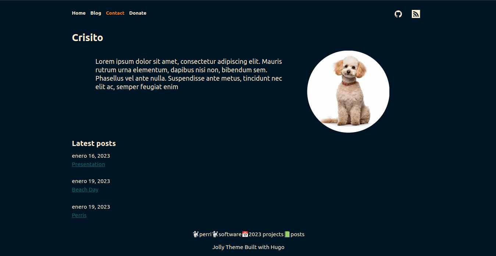
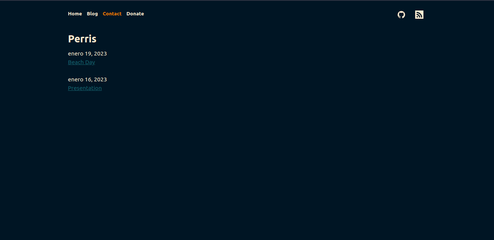

# Jolly
Lightweight and simple theme for Hugo.




### Features
-   RRSS support.
-   Categories and sections.
-   Custom presentation.
-   Next and prev tags for blogging.
-   Responsive


### Set up 
```bash
git submodule add https://github.com/CrisitoJ/jolly themes/jolly
```
```bash
 #set up the theme adding this line on config.toml
 theme = "jolly"
```

## Advanced configs
Add your presentation on
```bash
    #for each paragraph
    [params]
    presentation = "your presentation"
```
Add you personal photo
```bash
    [[params]]
    gif = "link"
```
## Add categories:
For each categorie you want to add to the main page add:
```bash
[[menu.categories]]
 name = "category"
 url = "/category"
```
## Add RSS links
Firstly, you need to download the .SVG for each RSS you want to add, then add them into /assets/icons
Then, you will be able to set up the RSS on your config.toml
For each rss add:
```bash
[[menu.social]]
  name = "GitHub"
  pre = "github"
  url = "https://github.com/myuser"
```

